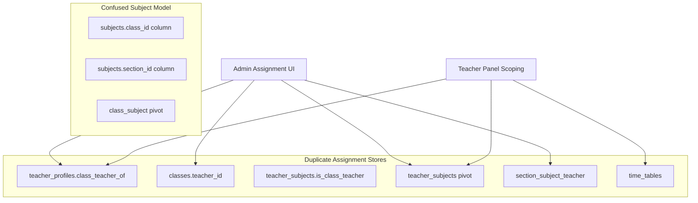
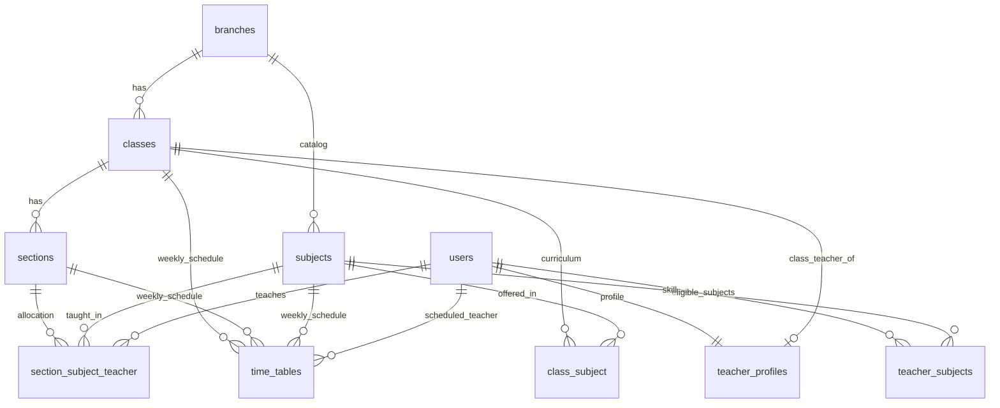
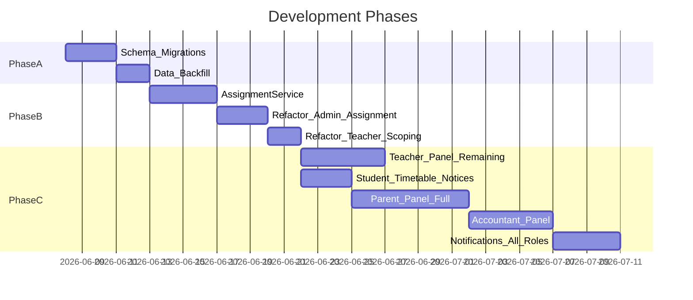

# Skoolyst SMS — Complete App Structure Plan

Target file: [`app_structure_plate.txt`](app_structure_plate.txt) (currently empty)

This plan covers **database cleanup**, **code logic unification**, and **per-role panel completion** based on the issues identified in migration/schema review and current codebase survey.

---

## Part 1 — Current Problems (Summary)



| Issue | Risk | Files affected |
|-------|------|----------------|
| Class teacher in 3+ places | Data mismatch after partial updates | [`SubjectController.php`](app/Http/Controllers/Admin/SubjectController.php), [`TeacherController.php`](app/Http/Controllers/Admin/TeacherController.php), [`ClassesController.php`](app/Http/Controllers/Admin/ClassesController.php) |
| `subjects` has `class_id` + `section_id` + `class_subject` pivot | Contradictory curriculum data | [`Subject.php`](app/Models/Subject.php), [`SubjectController.php`](app/Http/Controllers/Admin/SubjectController.php) |
| `teacher_subjects` overlaps `section_subject_teacher` | Teacher panel uses different source than admin allocation | [`ScopesTeacherAssignments.php`](app/Http/Controllers/Teacher/Concerns/ScopesTeacherAssignments.php), [`SubjectTeacherController.php`](app/Http/Controllers/Admin/SubjectTeacherController.php) |
| `section_subject_teacher.class_id` redundant | Sync drift possible | [`SectionSubjectTeacher.php`](app/Models/SectionSubjectTeacher.php) |
| `teacher_subjects` has no `branch_id` | Cross-branch leak in multi-branch | migration missing from [`2026_06_04_000005`](database/migrations/2026_06_04_000005_add_branch_id_to_scoped_tables.php) |

---

## Part 2 — Target Data Architecture (Single Source of Truth)

### Recommended canonical model



### Role of each table (final decision)

| Table / Column | Role | Action |
|----------------|------|--------|
| `subjects` | **Master catalog only** (`name`, `code`, `branch_id`) | Remove `class_id`, `section_id` columns |
| `class_subject` | **Curriculum**: which subjects each class offers | Keep — primary |
| `teacher_subjects` | **Capability**: subjects a teacher is qualified to teach | Keep + add `branch_id`; remove `is_class_teacher`, `class_id` from pivot |
| `section_subject_teacher` | **Allocation**: who teaches subject X in section Y | Keep — primary for teacher scoping |
| `teacher_profiles.class_teacher_of` | **Class teacher** designation | Keep — **only** source of truth |
| `classes.teacher_id` | Duplicate class teacher | **Deprecate then drop** |
| `teacher_profiles.is_class_teacher` | Redundant flag | Drop — derive from `class_teacher_of IS NOT NULL` |
| `time_tables` | **Weekly period schedule only** | Keep; validate teacher against `section_subject_teacher` on save |

---

## Part 3 — Phase A: Database Migrations (Dev-safe order)

### A1 — Add missing constraints
- Add `branch_id` to `teacher_subjects`
- Add `branch_id` to `class_subject` and `section_subject_teacher` (for branch scoping)
- Add composite unique on `section_subject_teacher`: already has `(section_id, subject_id)` — good

### A2 — Data backfill script (Artisan command or seeder)
New file: `database/seeders/AcademicDataConsolidationSeeder.php`
1. Copy `subjects.class_id` relationships into `class_subject` pivot where missing
2. Sync `teacher_profiles.class_teacher_of` → stop writing `classes.teacher_id` going forward
3. For each `time_tables` row, ensure matching `section_subject_teacher` row exists (or flag orphans)
4. Null out `subjects.class_id` and `subjects.section_id` after pivot backfill

### A3 — Schema cleanup migrations
New migrations (in order):
1. `drop_class_id_section_id_from_subjects_table`
2. `drop_teacher_id_from_classes_table`
3. `drop_is_class_teacher_from_teacher_profiles_table`
4. `simplify_teacher_subjects_table` — drop `class_id`, `is_class_teacher`; add `branch_id`
5. `drop_class_id_from_section_subject_teacher` — derive via `sections.class_id` (optional: keep as denormalized with DB trigger or model observer — recommend drop for cleanliness)

### A4 — Soft-delete alignment
Ensure all academic tables use consistent `deleted_at` + `branch_id` scoping via [`BelongsToSchoolBranch`](app/Models/Concerns/BelongsToSchoolBranch.php) trait.

---

## Part 4 — Phase B: Shared Service Layer (Code Logic Unification)

Create one service to replace scattered assignment logic:

**New:** `app/Services/Academic/AssignmentService.php`

| Method | Responsibility |
|--------|----------------|
| `assignClassCurriculum(class, subjectIds)` | Sync `class_subject` only |
| `assignTeacherCapabilities(teacher, subjectIds)` | Sync `teacher_subjects` only |
| `assignSectionTeachers(section, subjectTeacherMap)` | Sync `section_subject_teacher` only |
| `assignClassTeacher(teacher, class)` | Set `teacher_profiles.class_teacher_of`; clear previous holder |
| `getTeacherScope(teacher)` | Return allowed `(class_id, section_id, subject_id)` tuples |
| `validateTimetableSlot(class, section, subject, teacher)` | Check allocation exists before timetable save |

**Refactor these controllers to use AssignmentService:**
- [`SubjectController.php`](app/Http/Controllers/Admin/SubjectController.php) — `assignTeacherStore`, `assignClassTeacherStore`, `assignClassSubjectStore`
- [`SubjectTeacherController.php`](app/Http/Controllers/Admin/SubjectTeacherController.php) — `store`
- [`TimetableController.php`](app/Http/Controllers/Timetable/TimetableController.php) — `store`, `store_schedule`
- [`TeacherController.php`](app/Http/Controllers/Admin/TeacherController.php) — create/update class teacher
- [`ClassesController.php`](app/Http/Controllers/Admin/ClassesController.php) — remove direct `teacher_id` writes

**Replace trait logic:**
- Rewrite [`ScopesTeacherAssignments.php`](app/Http/Controllers/Teacher/Concerns/ScopesTeacherAssignments.php) to read from `AssignmentService::getTeacherScope()` using `section_subject_teacher` + `class_teacher_of` (not `time_tables` + `teacher_subjects` intersect)

**Update models:**
- [`User.php`](app/Models/User.php) — `allAssignedClasses()` becomes thin wrapper over service
- [`Classes.php`](app/Models/Classes.php) — remove `classTeacher()` via `teacher_id`; use `classTeacherProfiles()` only
- [`Subject.php`](app/Models/Subject.php) — remove direct `class_id` from fillable; curriculum via `classes()` relation only

---

## Part 5 — Phase C: Admin Panel Plan

**Status today:** ~95% complete ([`routes/web.php`](routes/web.php) L86–297)

### C1 — Academic Setup consolidation (priority)
Merge 3 assignment UIs into one guided flow:

```
Academic Setup
├── Classes & Sections (existing)
├── Subject Catalog (master list only)
├── Class Curriculum (class_subject)
├── Teacher Capabilities (teacher_subjects)
├── Section Teacher Allocation (section_subject_teacher) ← primary
├── Class Teacher Assignment (teacher_profiles.class_teacher_of)
└── Timetable (validates against allocation)
```

Views to update:
- [`assign.blade.php`](resources/views/app/admin/subjects/assign.blade.php) — remove class teacher dual-sync UI confusion
- [`assign_section_teacher.blade.php`](resources/views/app/admin/subjects/assign_section_teacher.blade.php) — make this the main allocation screen
- [`classes/create.blade.php`](resources/views/app/admin/classes/create.blade.php), [`edit.blade.php`](resources/views/app/admin/classes/edit.blade.php) — remove `teacher_id` dropdown

### C2 — Admin remaining stubs
| Feature | Work needed |
|---------|-------------|
| Notifications | Controller + views + real-time or polling |
| User resource | Complete `edit`/`show`/`destroy`; add [`users/edit.blade.php`](resources/views/app/users/) |
| Academic landing | Wire route to [`academic_setup.blade.php`](resources/views/app/admin/academic/academic_setup.blade.php) or delete orphan |
| Exam schedule subjects | Already has `getSubjects` route — ensure it uses `class_subject` not `subjects.class_id` |

### C3 — Admin reports enhancement
- Filter reports by branch, class, section using unified assignment data
- Files: [`ReportController.php`](app/Http/Controllers/Report/ReportController.php)

---

## Part 6 — Teacher Panel Plan

**Status today:** ~60% complete

### Done
- Profile, My Students, Mark Attendance, Exams (Create Tests + Enter Marks)

### T6.1 — Fix scoping (after Phase B)
Update:
- [`StudentController.php`](app/Http/Controllers/Teacher/StudentController.php)
- [`AttendanceController.php`](app/Http/Controllers/Teacher/AttendanceController.php)
- [`ExamController.php`](app/Http/Controllers/Teacher/ExamController.php)
- [`ExamResultController.php`](app/Http/Controllers/Teacher/ExamResultController.php)

All should use `section_subject_teacher` + `class_teacher_of` via `AssignmentService`.

### T6.2 — Build remaining features

| Feature | Route | Controller | View |
|---------|-------|------------|------|
| Dashboard | `teacher.dashboard` | `Teacher\DashboardController` | `app/teacher/dashboard.blade.php` |
| My Subjects | `teacher.subjects` | `Teacher\SubjectController` | `app/teacher/subjects/index.blade.php` — read-only allocation view |
| My Timetable | `teacher.timetable` | `Teacher\TimetableController` | `app/teacher/timetable/index.blade.php` — filtered to logged-in teacher |
| My Reports | `teacher.reports` | `Teacher\ReportController` | `app/teacher/reports/index.blade.php` — class attendance %, exam stats |

### T6.3 — Sidebar fixes
[`sidebar.blade.php`](resources/views/app/layouts/sidebar.blade.php):
- Wire `teacher_subjects`, `teacher_reports`, dashboard links
- Fix teacher logout (`route('logout')`)
- Update [`SidebarSettingsSeeder.php`](database/seeders/SidebarSettingsSeeder.php) routes

---

## Part 7 — Student Panel Plan

**Status today:** ~85% complete

### Done
Profile, Attendance, Results, Fees, Books, Dashboard

### S7.1 — Remaining work

| Feature | Route | Controller | View |
|---------|-------|------------|------|
| My Timetable | `student.timetable` (exists) | `Student\TimetableController` | `app/student/timetable/index.blade.php` — show own class/section only |
| Notices | `student.notices` | `Student\NoticeController` | `app/student/notices/index.blade.php` |
| Notifications | `student.notifications` | shared or `Student\NotificationController` | TBD |

### S7.2 — Stop reusing admin timetable view
Current: `student.timetable` → shared [`TimetableController`](app/Http/Controllers/Timetable/TimetableController.php) shows all branch classes. Replace with student-scoped controller reading `auth()->user()->studentProfile`.

---

## Part 8 — Parent Panel Plan

**Status today:** ~5% (JSON stubs only)

### P8.1 — New namespace
```
app/Http/Controllers/Parent/
├── DashboardController.php
├── ChildrenController.php
├── AttendanceController.php
├── ResultController.php
├── FeeController.php
├── BookIssueController.php
└── NoticeController.php
```

### P8.2 — Routes ([`web.php`](routes/web.php) L348–353 replace stubs)
| Route | Feature |
|-------|---------|
| `parent.dashboard` | Overview of all children |
| `parent.children` | List linked children (`student_parents` pivot) |
| `parent.children/{student}/attendance` | Per-child attendance |
| `parent.children/{student}/results` | Per-child exam results |
| `parent.fees` | Fee status across children |
| `parent.books` | Library issues for children |
| `parent.notices` | Branch notices |

### P8.3 — Authorization
New middleware or policy: `ParentCanAccessStudent` — verify `student_parents` link before showing child data.

### P8.4 — Views
```
resources/views/app/parent/
├── dashboard.blade.php
├── children/index.blade.php
├── attendance/index.blade.php
├── results/index.blade.php
├── fees/index.blade.php
├── books/index.blade.php
└── notices/index.blade.php
```

### P8.5 — Sidebar
Add parent panel block in [`sidebar.blade.php`](resources/views/app/layouts/sidebar.blade.php) + update seeder routes (currently empty `href=""`).

---

## Part 9 — Accountant Panel Plan

**Status today:** ~5% (JSON stubs, no sidebar)

### A9.1 — New namespace
```
app/Http/Controllers/Accountant/
├── DashboardController.php
├── FeeController.php      (reuse Fees models, accountant-scoped)
├── PaymentController.php
└── ReportController.php
```

### A9.2 — Routes
Replace stubs at [`web.php`](routes/web.php) L355–358:
- `accountant.dashboard`
- `accountant.fees` — view/record payments (subset of admin fees)
- `accountant.payments` — payment history
- `accountant.reports` — fee collection reports

### A9.3 — Permissions
Wire existing permissions from [`PermissionsSeeder.php`](database/seeders/PermissionsSeeder.php): `fees.view`, `fees.manage`, `reports.view`

### A9.4 — Sidebar
Add accountant section to [`SidebarSettingsSeeder.php`](database/seeders/SidebarSettingsSeeder.php) (currently missing entirely).

---

## Part 10 — Cross-Cutting Concerns

### Notifications (all roles)
- Single `NotificationController` + `notifications` table (if not exists, add migration)
- Wire sidebar `notifications.index` stub

### Branch scoping
- All new queries must use `scope.branch` middleware + `branch_id` on every academic table
- Audit [`TestDataSeeder.php`](database/seeders/TestDataSeeder.php) after schema changes

### Testing checklist (per phase)
- Admin assigns curriculum → section teacher → timetable validates
- Teacher sees only allocated students/subjects
- Student sees only own class timetable
- Parent sees only linked children
- Class teacher change clears old teacher automatically

---

## Part 11 — Recommended Execution Order



| Phase | Duration est. | Deliverable |
|-------|---------------|-------------|
| **A** — DB cleanup | 5 days | Clean schema, backfilled data |
| **B** — Logic unification | 9 days | `AssignmentService`, no duplicate writes |
| **C** — Teacher remaining | 5 days | Dashboard, subjects, timetable, reports |
| **D** — Student polish | 3 days | Own timetable + notices |
| **E** — Parent panel | 7 days | Full parent portal |
| **F** — Accountant panel | 5 days | Fee-focused role UI |
| **G** — Notifications | 4 days | All roles |

**Total estimate:** ~5–6 weeks (single developer)

---

## Part 12 — Files to Create / Modify (Master List)

### New files
- `app/Services/Academic/AssignmentService.php`
- `app/Policies/ParentStudentPolicy.php`
- `database/seeders/AcademicDataConsolidationSeeder.php`
- 4–5 cleanup migrations (Part 3)
- `app/Http/Controllers/Teacher/DashboardController.php`
- `app/Http/Controllers/Teacher/SubjectController.php`
- `app/Http/Controllers/Teacher/TimetableController.php`
- `app/Http/Controllers/Teacher/ReportController.php`
- `app/Http/Controllers/Student/TimetableController.php`
- `app/Http/Controllers/Student/NoticeController.php`
- `app/Http/Controllers/Parent/*` (7 controllers)
- `app/Http/Controllers/Accountant/*` (4 controllers)
- Views under `resources/views/app/teacher/`, `student/`, `parent/`, `accountant/`

### Critical modifications
- [`ScopesTeacherAssignments.php`](app/Http/Controllers/Teacher/Concerns/ScopesTeacherAssignments.php)
- [`SubjectController.php`](app/Http/Controllers/Admin/SubjectController.php)
- [`ClassesController.php`](app/Http/Controllers/Admin/ClassesController.php)
- [`TimetableController.php`](app/Http/Controllers/Timetable/TimetableController.php)
- [`User.php`](app/Models/User.php), [`Classes.php`](app/Models/Classes.php), [`Subject.php`](app/Models/Subject.php)
- [`routes/web.php`](routes/web.php)
- [`sidebar.blade.php`](resources/views/app/layouts/sidebar.blade.php)
- [`SidebarSettingsSeeder.php`](database/seeders/SidebarSettingsSeeder.php)
- [`app_structure_plate.txt`](app_structure_plate.txt) — this full plan document

---

## Default decisions (user skipped questionnaire)

- **Class teacher source of truth:** `teacher_profiles.class_teacher_of` (drop `classes.teacher_id`)
- **teacher_subjects role:** Keep as teacher capability/eligibility list (not allocation)
- **Teacher scoping source:** `section_subject_teacher` + `class_teacher_of` (not `time_tables`)

After plan approval, switch to **Agent mode** to write the full formatted document into `app_structure_plate.txt` and begin Phase A migrations.
